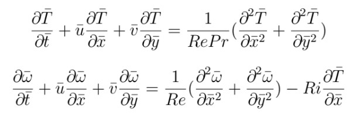
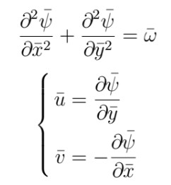
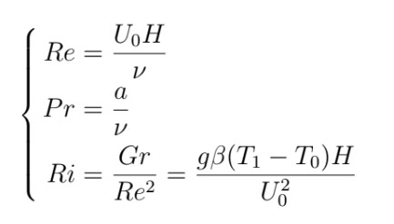
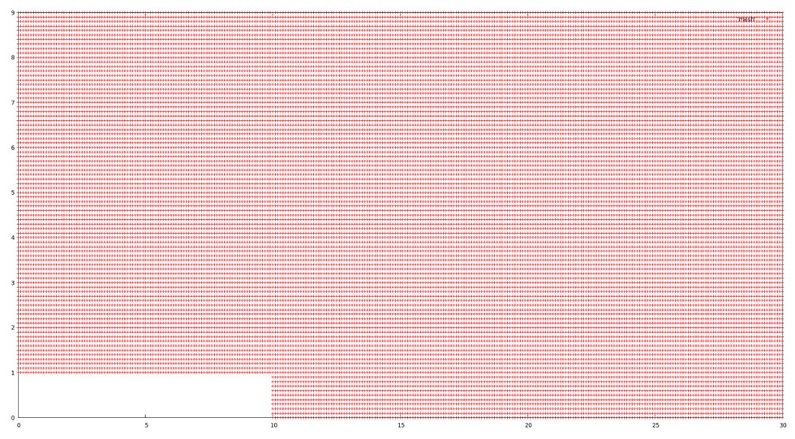
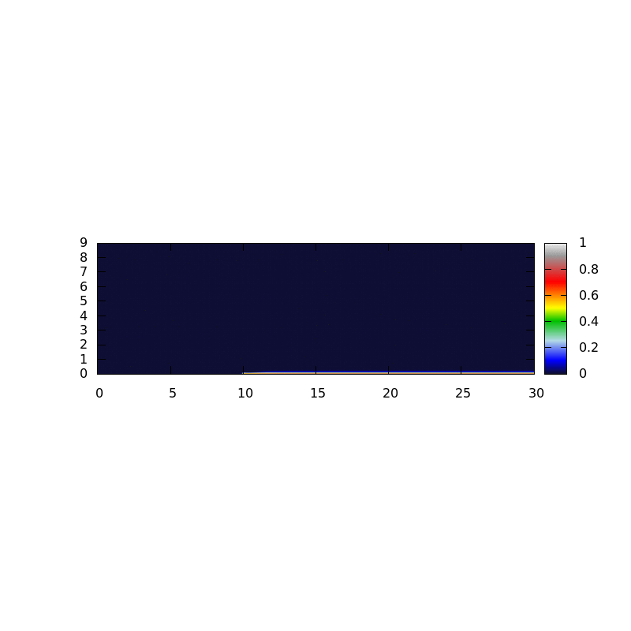

## Navier-Stokes Equation Solver using Streamfunction and Vorticity Method

This repository contains a Fortran program that solves the Navier-Stokes equations using the Streamfunction and Vorticity method. The Streamfunction and Vorticity method is a numerical approach to solving the Navier-Stokes equations that avoids the explicit calculation of pressure, simplifying the simulation and reducing computational overhead.

Additionally, the Navier-Stokes equations are coupled with the heat transfer equation, including a buoyancy term to account for the effects of buoyancy-driven flow. The heat transfer equation is solved simultaneously with the Navier-Stokes equations using the Finite Difference Method.

## Methodology

The Navier-Stokes equations are a set of partial differential equations that describe the motion of fluid flow. They consist of three equations: one for the conservation of mass (continuity equation) and two for the conservation of momentum (momentum equations). These equations are notoriously challenging to solve, particularly due to the coupling between velocity and pressure fields.

The Streamfunction and Vorticity method provides an alternative approach to solve the Navier-Stokes equations. Instead of directly solving for velocity and pressure, the method introduces two auxiliary fields: the streamfunction (Ψ) and vorticity (ω). By utilizing these auxiliary fields, the method decouples the velocity and pressure, simplifying the solution process.

The heat transfer equation accounts for the transfer of thermal energy within the fluid and includes a buoyancy term, which arises from density variations due to temperature differences. This buoyancy term influences the fluid flow, leading to buoyancy-driven convection.

## Governing Equations

The numerical simulation of the fluid flow and heat transfer in the backward step geometry is governed by the following equations:

### Navier-Stokes Equations with Energy Equation

The dimensionless incompressible Navier-Stokes equations for the fluid flow and the energy equation, accounting for the transfer of thermal energy,are given by:




Where:

Re is the Reynolds number represents the ratio of inertial forces to viscous forces 
Pr is the Prandtl number is the ratio of momentum diffusivity to thermal diffusivity 
Ri is The Richardson number represents the ratio of buoyancy forces to shear forces 



## Numerical Methods

The numerical simulation of the fluid flow and heat transfer in the backward step geometry utilizes various numerical methods to discretize the partial differential equations in space and time. The key numerical methods employed are:

### Finite Difference Method

The Finite Difference Method is used to discretize the spatial derivatives in the partial differential equations. The computational domain is discretized into a grid, where each grid point represents a spatial location. Second-order spatial discretization is applied, which provides higher accuracy compared to first-order schemes. This spatial discretization allows us to approximate the derivatives with finite difference approximations.

### Alternating Direction Implicit (ADI) Method

For time-stepping, the Alternating Direction Implicit (ADI) method is used. The ADI method is a powerful technique to numerically solve time-dependent partial differential equations in an efficient and stable manner. It treats the temporal derivatives implicitly while handling the spatial derivatives explicitly. This approach allows for a computationally stable and accurate time advancement of the solution.

### Successive Over-Relaxation (SoR)

To solve the Poisson equation that arises in the Streamfunction and Vorticity method, the Successive Over-Relaxation (SoR) method is employed. The Poisson equation is a partial differential equation that involves the pressure field. SoR is an iterative technique that updates the pressure field at each grid point until convergence is achieved. The over-relaxation parameter in SoR helps accelerate the convergence of the iterative solution.

## Overview of the Numerical Methods

1. **Spatial Discretization:** The domain is divided into a grid, and second-order finite difference approximations are used to represent the spatial derivatives in the partial differential equations.

2. **Time-Stepping:** The ADI method is utilized for time-stepping, where the temporal derivatives are handled implicitly and the spatial derivatives are treated explicitly. This ensures numerical stability and accuracy during time advancement.

3. **Streamfunction Solution:** The Poisson equation is solved using the Successive Over-Relaxation (SoR) method, which iteratively updates the Stream function field until convergence is achieved.


## Geometry
The geometry of the fluid domain in this simulation includes a backward step, a common configuration used to study flow separation and recirculation phenomena. The backward step geometry consists of a channel with a sudden expansion at a specific location, forming a step-like shape. The figure below illustrates the geometry of the domain:



## Files Description

The program is organized with the following files:

1. `parameters.f90`: This module contains various parameters and constants used in the simulation.

2. `main.f90`: The main program that initializes the simulation, performs time-stepping, and handles the overall flow of the solution.

3. `algo_tdma.f90`: This module implements the Tridiagonal Matrix Algorithm (TDMA), also known as the Thomas algorithm, which efficiently solves tridiagonal systems of equations that arise in the Streamfunction and Vorticity method.

4. `initialisation.f90`: This module handles the initialization of the simulation, setting up the initial conditions for the streamfunction and vorticity fields.

5. `boundary_condition.f90`: The module responsible for applying boundary conditions to the simulation domain.

### Compiling and Running the Program

To compile the program, use the provided Makefile by running the following command in the terminal:

```
make
```

The Makefile sets the compiler and compilation options. The compiled executable will be named step.

To run the program, simply execute the compiled binary:

```
./step
```

### Cleaning Up
To remove the object files and the executable, use the following command:

```
make clean
```

This will clean the directory from unnecessary files.

### Requirements

To compile and run the program, you need a Fortran compiler that supports Fortran 95 standard. The code is designed to work with f95, but you can adjust the FC variable in the Makefile to use a different compiler if needed.


## Examples

Here are visualizations of the simulation results using different values of Reynolds number (Re) and Richardson number (Ri).

### Re = 100 and Ri = 0.5


### Re = 500 and Ri = 0.5


### Re = 500 and Ri = -0.5



## Post-Processing

Additionally, this repository includes a folder called gnuplot where post-processing scripts are placed. These scripts can be used to generate visualizations and analyze the simulation results. The post-processing scripts utilize Gnuplot, a versatile plotting program, to create various plots and animations from the simulation data.


## Disclaimer
This program is intended for educational and research purposes only. It may not be suitable for production-level applications. 


Please feel free to use and modify this code for your own purposes. If you find any issues or have suggestions for improvement, I welcome your feedback.


